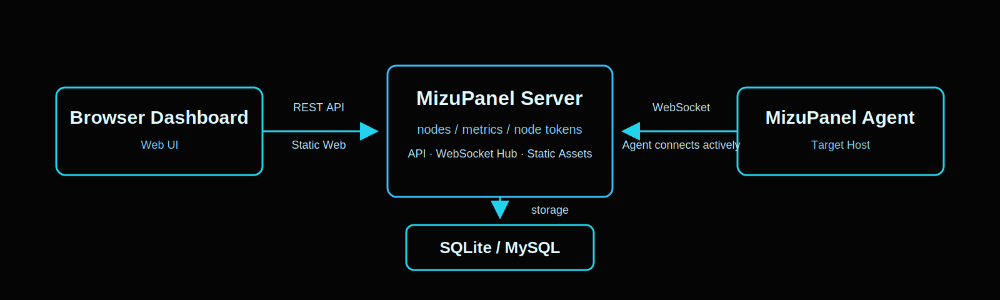
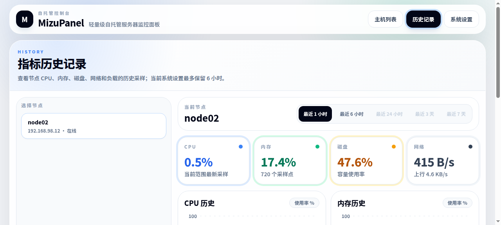
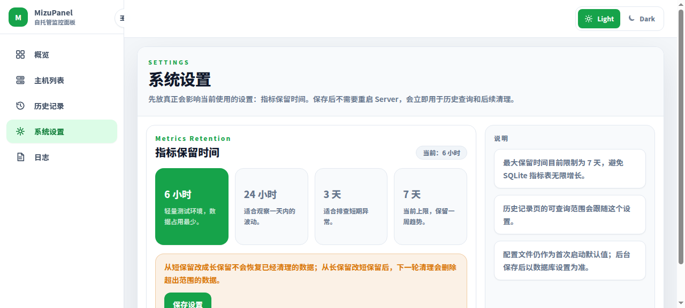
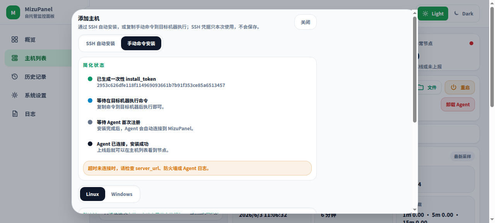
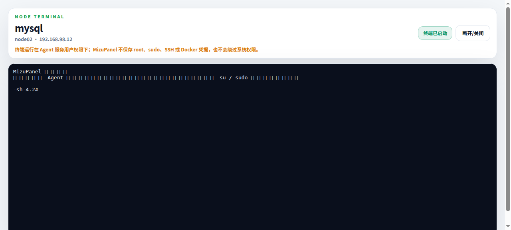

<p align="center">
  
</p>

<p align="center">
  <a href="https://go.dev/"></a>
  <a href="https://react.dev/"></a>
  <a href="https://vite.dev/"></a>
  <a href="https://www.sqlite.org/"></a>
  <a href="https://www.docker.com/"></a>
  <a href="https://www.mysql.com/"></a>
  
  
</p>

<p align="center">
  <strong>Lightweight self-hosted server monitoring</strong>
</p>

<p align="center">
  English · <a href="README.md">中文</a>
</p>

---

## Overview

MizuPanel is a lightweight self-hosted server monitoring panel for personal servers and small fleets. It is composed of a Server, a Dashboard, and Agents. Agents actively connect to the Server over WebSocket and report CPU, memory, disk, network, and load metrics.

> Note: the current preview temporarily has no login gate. `/api/install/command` can mint install tokens without authentication. Restore minimal admin authentication before exposing MizuPanel publicly.

## Features

Core features:

- Multi-node server list and node details.
- CPU, memory, disk, network, and load metrics.
- Historical metrics queries with 6-hour default retention.
- Dashboard-generated Linux and Windows Agent install commands.
- Agents actively connect to Server; target hosts do not expose Agent ports.

Stack and deployment:

- React + Vite + Tailwind CSS v3 Dashboard.
- Server-hosted web assets, installer script, and Agent downloads.
- Local SQLite persistence with optional MySQL storage.
- Docker Compose deployment with SQLite by default.
- One-time `install_token` for first registration and long-lived `node_token` for reconnects.
- Linux amd64 / arm64 and Windows amd64 Agent binaries bundled in the release package.

## Architecture

<p align="center">
  
</p>

## Screenshots

| Dashboard | Metrics history |
| --- | --- |
|  |  |

| System settings | Add host |
| --- | --- |
|  |  |

| Web terminal |
| --- |
|  |

## Docker quick start

Docker is the simplest way to run MizuPanel. The default Compose file uses SQLite, so one command is enough:

```bash
docker compose up -d
```

Open the Dashboard:

```text
http://127.0.0.1:8080
```

By default Compose binds the panel to `127.0.0.1` only. For a self-managed LAN/server deployment, expose it explicitly:

```bash
MIZUPANEL_BIND_ADDR=0.0.0.0 docker compose up -d
```

Then open:

```text
http://your-server-ip:8080
```

SQLite mode uses `docker/server.sqlite.yaml`, which is copied into the image as `/app/server.yaml`. Runtime data is persisted to:

```text
./data/mizupanel.db
```

Useful commands:

```bash
docker compose logs -f
docker compose down
```

### Docker with MySQL

The MySQL Compose file uses `docker/server.mysql.yaml`, mounted into the container as `/app/server.yaml`. Set database credentials with environment variables first:

```bash
export MIZUPANEL_MYSQL_DATABASE=mizupanel
export MIZUPANEL_MYSQL_USERNAME=mizupanel
export MIZUPANEL_MYSQL_PASSWORD='change-this-password'
export MIZUPANEL_MYSQL_ROOT_PASSWORD='change-this-root-password'
```

Start the MySQL deployment:

```bash
docker compose -f docker-compose.mysql.yml up -d
```

Expose it to a LAN/server IP explicitly if needed:

```bash
MIZUPANEL_BIND_ADDR=0.0.0.0 docker compose -f docker-compose.mysql.yml up -d
```

MySQL data is stored in the Docker volume:

```text
mizupanel_mizupanel-mysql-data
```

Stop without deleting data:

```bash
docker compose -f docker-compose.mysql.yml down
```

Stop and delete the MySQL data volume:

```bash
docker compose -f docker-compose.mysql.yml down -v
```

## Release layout

Build the release package for the Server architecture you need:

```bash
make package-linux-amd64 # x86_64 / amd64 servers
make package-linux-arm64 # ARM64 / aarch64 servers
```

`make build`, `make package`, and `make build-x86` build the amd64 package. `make build-arm` builds the arm64 package.

The selected target creates the matching release directory and archive:

```text
dist/
├── mizupanel-linux-amd64/
├── mizupanel-linux-amd64.tar.gz
├── mizupanel-linux-arm64/
└── mizupanel-linux-arm64.tar.gz
```

Each extracted package contains:

```text
mizupanel-linux-amd64/
├── mizupanel-server
├── server.example.yaml
├── data/
├── scripts/
│   ├── install-agent.sh
│   ├── install-agent.ps1
│   ├── uninstall-agent.sh
│   └── uninstall-agent.ps1
├── systemd/
│   ├── mizupanel-server.service
│   └── mizupanel-agent.service
├── downloads/
│   ├── mizupanel-agent-linux-amd64
│   ├── mizupanel-agent-linux-arm64
│   └── mizupanel-agent-windows-amd64.exe
└── web/
    ├── index.html
    └── assets/
```

The Server uses CGO for SQLite, so the arm64 Server package requires an arm64 C cross compiler such as `aarch64-linux-gnu-gcc`. On Debian/Ubuntu, install it with `sudo apt install gcc-aarch64-linux-gnu`.

## Release package deployment

### 1. Prepare the release directory

```bash
make build
tar -xzf dist/mizupanel-linux-amd64.tar.gz
cd mizupanel-linux-amd64
cp server.example.yaml server.yaml
```

Use `make package-linux-arm64` and `mizupanel-linux-arm64.tar.gz` instead on arm64 servers. `server.example.yaml` is the versioned template. `server.yaml` is your local runtime config, so you can edit it without changing the template. The package includes `data/`, and the default database path writes SQLite data to `./data/mizupanel.db`.

### 2. Edit `server.yaml`

```yaml
server:
  listen: ":8080" # HTTP listen address for the MizuPanel Server.
  public_url: "" # Public panel URL used to generate Agent install commands; leave empty to infer from the request host.
  enable_terminal: true # Enables browser terminal routes; Linux Agents must also opt in with features.terminal: true.

storage:
  driver: "sqlite" # sqlite | mysql. SQLite is the default.
  database_path: "./data/mizupanel.db" # Legacy SQLite path; kept for compatibility.
  sqlite:
    path: "./data/mizupanel.db"
  mysql:
    host: "127.0.0.1"
    port: 3306
    username: "mizupanel"
    password: ""
    database: "mizupanel"

metrics:
  retention: "6h" # How long historical metrics are kept before cleanup.
  cleanup_interval: "10m" # How often the retention cleanup job runs.

security:
  # agent_token is optional and should only be set if you need a long-lived bootstrap token.
  # Prefer the Dashboard-generated one-time install token flow for adding hosts.
  # agent_token: "change-this-to-a-random-secret" # Optional long-lived Agent bootstrap token; avoid exposing it in browsers or public docs.
```

Set `public_url` if Agents will access the panel from another machine:

```yaml
server:
  public_url: "http://your-server-ip:8080"
```

### 3. Start Server directly

```bash
./mizupanel-server -config server.yaml
```

Open:

```text
http://your-server-ip:8080
```

### 4. Optional: run with systemd

The release package includes `systemd/mizupanel-server.service` as an example for `/opt/mizupanel`; adjust the paths for your host and run `systemctl enable --now mizupanel-server`.

## Agent setup

Open the Dashboard and click **Add Host**. For Linux hosts, choose **SSH automatic install** to let the Server use the one-time root SSH credentials you enter for this request only, or choose **manual command install** and run the generated command on the target host. SSH credentials are not stored in the database, echoed back, or written to logs.

The first SSH install/uninstall version only supports Linux root users. It does not support sudo or Windows. Linux manual install/uninstall commands should also be run from a root shell.

<details>
<summary>Linux install command example</summary>

```bash
curl -fsSL 'http://your-panel-host:8080/scripts/install-agent.sh' -o install-agent.sh \
  && chmod +x install-agent.sh \
  && ./install-agent.sh \
    --binary-base-url 'http://your-panel-host:8080/downloads' \
    --server-url 'ws://your-panel-host:8080/api/agent/ws' \
    --token 'one-time-install-token' \
    --node-id "$(hostname)" \
    --name "$(hostname)"
```

</details>

<details>
<summary>Windows install command example</summary>

```powershell
powershell -NoProfile -ExecutionPolicy Bypass -Command "`$ErrorActionPreference='Stop'; `$script = Join-Path `$env:TEMP ('mizupanel-install-' + [guid]::NewGuid().ToString() + '.ps1'); Invoke-WebRequest -Uri 'http://your-panel-host:8080/scripts/install-agent.ps1' -UseBasicParsing -OutFile `$script -ErrorAction Stop; & `$script `
    -BinaryBaseUrl 'http://your-panel-host:8080/downloads' `
    -ServerUrl 'ws://your-panel-host:8080/api/agent/ws' `
    -Token 'one-time-install-token' `
    -NodeId `$env:COMPUTERNAME `
    -Name `$env:COMPUTERNAME"
```

</details>

The Linux installer selects the correct file from `downloads/`, then installs the Agent as:

```text
/usr/local/mizupanel/mizupanel-agent
/usr/local/mizupanel/agent.yaml
/etc/systemd/system/mizupanel-agent.service
```

Check the Linux Agent service:

```bash
systemctl status mizupanel-agent
journalctl -u mizupanel-agent -f
```

Linux Agent install permissions:

- `/usr/local/mizupanel` is managed by `root:root`.
- `/usr/local/mizupanel/mizupanel-agent` is root-owned and executable.
- `/usr/local/mizupanel/agent.yaml` is owned by `mizupanel-agent:mizupanel-agent` with `0600` permissions.
- systemd `ReadWritePaths` is limited to `agent.yaml` so the Agent can persist the exchanged `node_token` without being able to replace its own binary.

The Windows installer downloads `mizupanel-agent-windows-amd64.exe`, installs it as `C:\Program Files\MizuPanel\mizupanel-agent.exe`, writes `C:\Program Files\MizuPanel\agent.yaml`, and registers the `mizupanel-agent` Windows Service.

To uninstall the Linux Agent:

```bash
curl -fsSL 'http://your-panel-host:8080/scripts/uninstall-agent.sh' -o uninstall-agent.sh \
  && chmod +x uninstall-agent.sh \
  && ./uninstall-agent.sh
```

To uninstall the Windows Agent, run from an elevated PowerShell session:

```powershell
powershell -NoProfile -ExecutionPolicy Bypass -Command "`$ErrorActionPreference='Stop'; `$script = Join-Path `$env:TEMP ('mizupanel-uninstall-' + [guid]::NewGuid().ToString() + '.ps1'); Invoke-WebRequest -Uri 'http://your-panel-host:8080/scripts/uninstall-agent.ps1' -UseBasicParsing -OutFile `$script -ErrorAction Stop; & `$script"
```

Uninstalling stops and removes the Agent service and deletes the Agent install directory. It does not delete node records or historical metrics from the Server database.

Generated Agent configs use grouped YAML:

```yaml
server:
  url: "ws://your-panel-host:8080/api/agent/ws"
  token: "one-time-install-token"

node:
  id: "oracle-sg-01"
  name: "Oracle SG"

runtime:
  interval: "5s"
  mode: "normal"

features:
  docker: false
  terminal: false
```

## Token model

| Token           | Lifetime             | Issuer                                            | Stored in                                | Purpose                       |
| --------------- | -------------------- | ------------------------------------------------- | ---------------------------------------- | ----------------------------- |
| `install_token` | One-time             | Server when Dashboard creates an add-host command | Not persisted by Agent                   | First Agent registration only |
| `node_token`    | Long-lived, per node | Server after first registration succeeds          | Agent local config; Server stores a hash | Agent restarts and reconnects |

Registration flow:

```text
Dashboard creates install_token
        ↓
Agent registers for the first time
        ↓
Server verifies install_token
        ↓
Server exchanges it for node_token
        ↓
Agent reconnects with node_token
```

`install_token` is not intended as a persistent credential. `node_token` is stored on the Server side as a hash, not plaintext.

## Acknowledgements

Thanks to the Linux.do community for feedback, discussion, and inspiration.

<p align="center">
  <a href="https://linux.do/"></a>
</p>
