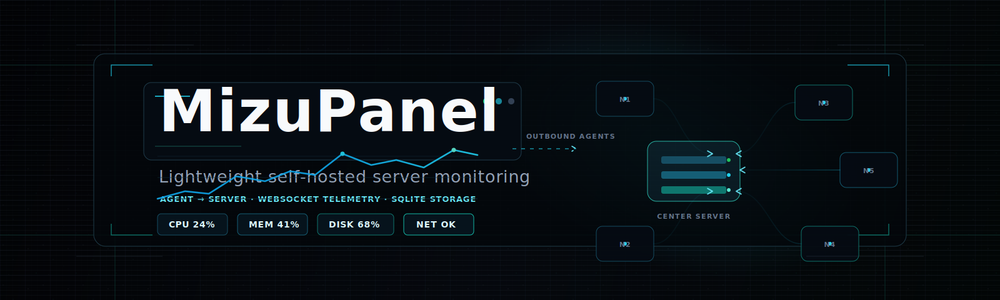
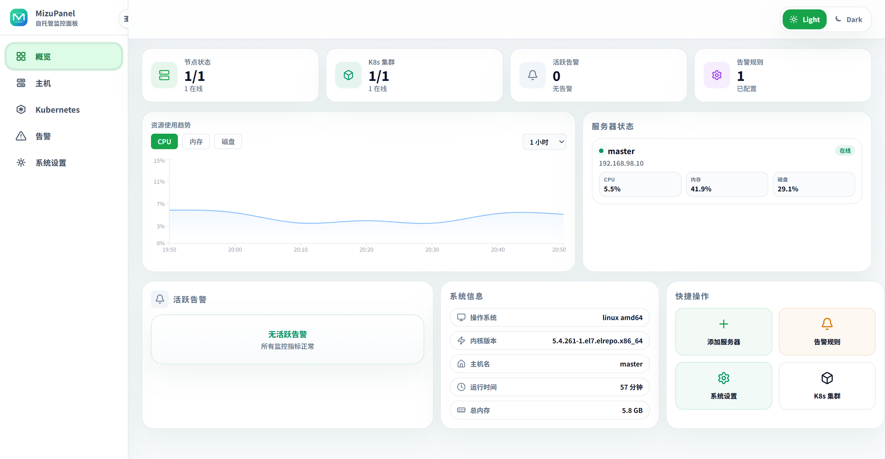
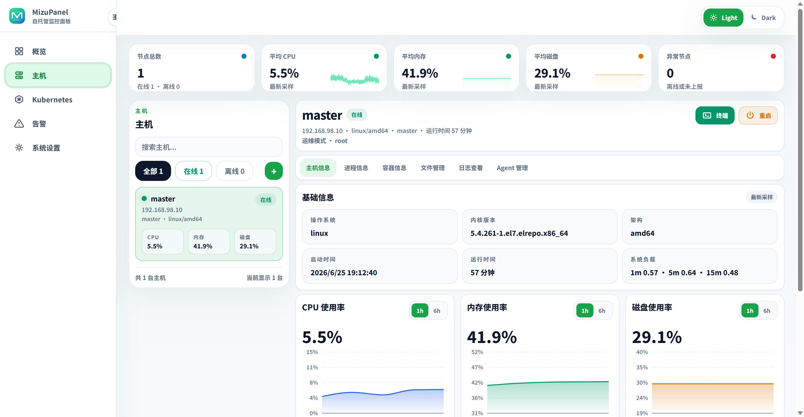
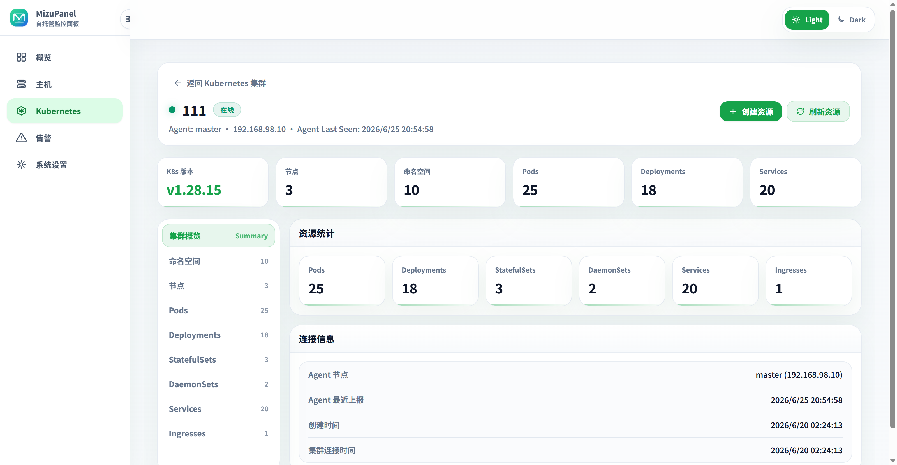
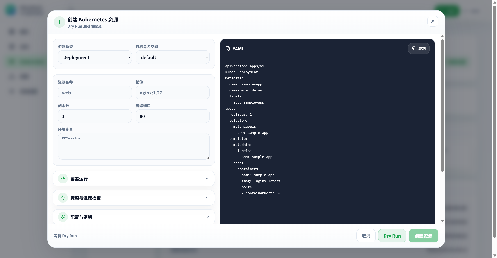
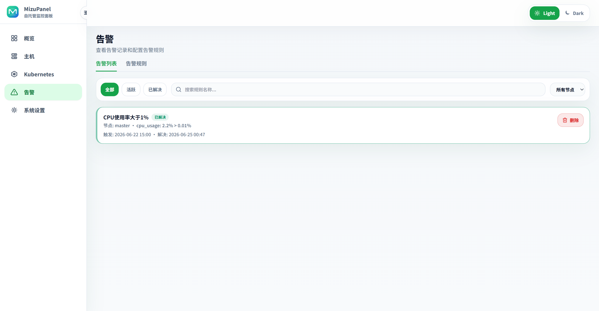

<p align="center">
  
</p>

<h1 align="center">MizuPanel</h1>

<p align="center">
  A lightweight self-hosted operations panel for hosts, Docker, alerts, and Kubernetes resources.
</p>

<p align="center">
  <a href="README.md">中文</a> · English
</p>

<p align="center">
  <a href="https://go.dev/"></a>
  <a href="https://react.dev/"></a>
  <a href="https://vite.dev/"></a>
  <a href="https://www.sqlite.org/"></a>
  <a href="https://www.docker.com/"></a>
  
</p>

<p align="center">
  <a href="assets/screenshots/dashboard.png">
    
  </a>
</p>

<p align="center">
  MizuPanel uses a Server + Dashboard + Agent architecture. Agents actively connect to the Server, report metrics, and carry allowed operations for personal servers, homelabs, small host fleets, and lightweight Kubernetes management.
</p>

<table>
  <tr>
    <td width="25%">
      <a href="assets/screenshots/host-detail.png"></a>
    </td>
    <td width="25%">
      <a href="assets/screenshots/k8s-detail.png"></a>
    </td>
    <td width="25%">
      <a href="assets/screenshots/k8s-create-resource.png"></a>
    </td>
    <td width="25%">
      <a href="assets/screenshots/alerts.png"></a>
    </td>
  </tr>
</table>

<p align="center"><strong>Features</strong></p>

<table>
  <tr>
    <td width="33%"><strong>Host Monitoring</strong><br /><sub>Node status, CPU, memory, disk, network, load, and historical trends.</sub></td>
    <td width="33%"><strong>Host Operations</strong><br /><sub>Processes, Docker containers, container logs, file manager, web terminal, Agent management.</sub></td>
    <td width="33%"><strong>Alerts</strong><br /><sub>Metric rules, duration checks, active alerts, alert history, and manual resolution.</sub></td>
  </tr>
  <tr>
    <td width="33%"><strong>Kubernetes Management</strong><br /><sub>Cluster access, resource summary, Namespace, Node, Pod, Workload, Service, and Ingress views.</sub></td>
    <td width="33%"><strong>K8s Diagnostics</strong><br /><sub>Pod logs, Events, Describe output, YAML view/edit, and resource actions.</sub></td>
    <td width="33%"><strong>Resource Creation</strong><br /><sub>Deployment, Pod, Service, Ingress, ConfigMap, Secret, PVC, Job, and CronJob.</sub></td>
  </tr>
</table>

<strong>Run From Release Package</strong>

Prefer the prebuilt package from GitHub Releases. Download the package that matches the Server machine:

```bash
# x86_64 / amd64
curl -LO https://github.com/LeoKon3/MizuPanel/releases/latest/download/mizupanel-linux-amd64.tar.gz

# ARM64 / aarch64
curl -LO https://github.com/LeoKon3/MizuPanel/releases/latest/download/mizupanel-linux-arm64.tar.gz
```

If you want to build from source locally, run:

```bash
# x86_64 / amd64
make package-linux-amd64

# ARM64 / aarch64
make package-linux-arm64
```

Extract the package and prepare local config:

```bash
tar -xzf mizupanel-linux-amd64.tar.gz
cd mizupanel-linux-amd64
cp server.example.yaml server.yaml
```

If Agents will access the panel from other machines, set the panel URL in `server.yaml` first:

```yaml
server:
  listen: ":8080"
  public_url: "http://your-server-ip:8080"
```

Start the Server:

```bash
./mizupanel-server -config server.yaml
```

Open `http://your-server-ip:8080`, then click **添加服务器** in the Dashboard to copy the Linux or Windows Agent install command.

The release package already includes web assets, installer scripts, and Agent downloads. Docker, MySQL, admin auth, systemd hosting, and token details are covered in the [configuration docs](docs/configuration.en.md). More interface previews are available in [screenshots](docs/screenshots.en.md).

<sub>Special thanks to the <a href="https://linux.do/">Linux.do</a> community for feedback, discussion, and inspiration.</sub>
