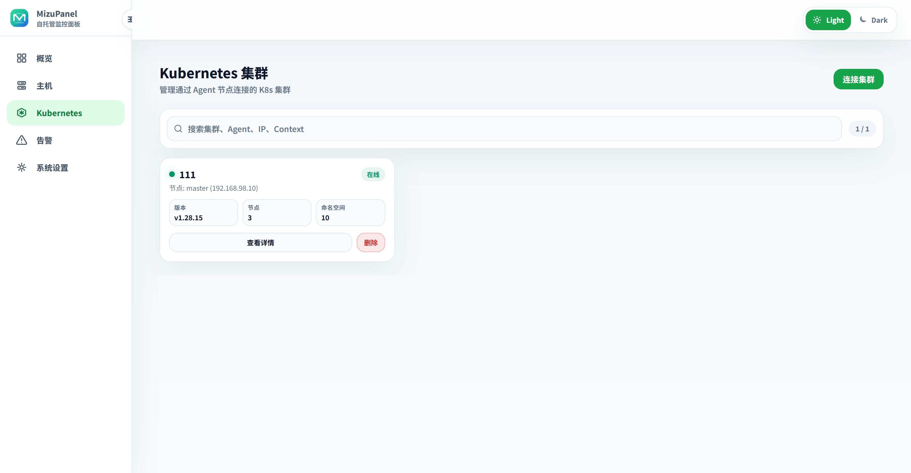
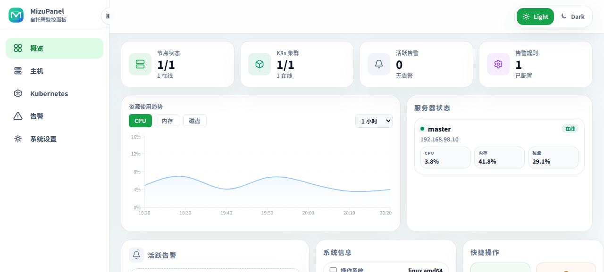
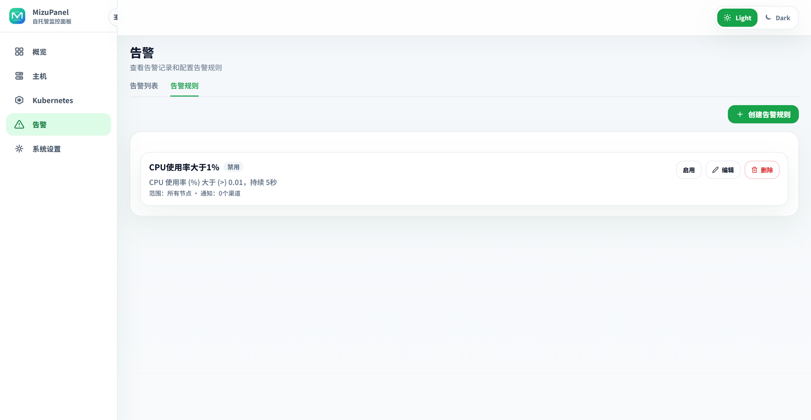

# Screenshots

[Back to README](../README.en.md) · [中文](screenshots.md)

These screenshots reflect the current interface. The README keeps only a compact preview; this page contains the fuller gallery.

## Overview

  

The overview shows node status, Kubernetes cluster status, active alerts, resource trends, server status, and quick actions.

## Hosts And Agents

<table>
  <tr>
    <td width="50%">
      
       Host detail, metric charts, Docker, processes, and Agent information.
    </td>
    <td width="50%">
      
       Add host and copy Linux or Windows Agent install commands.
    </td>
  </tr>
</table>

## Kubernetes

<table>
  <tr>
    <td width="50%">
      
       Kubernetes cluster access and search.
    </td>
    <td width="50%">
      
       Cluster detail, resource summary, Namespace, Node, Pod, Workload, Service, and Ingress views.
    </td>
  </tr>
  <tr>
    <td width="50%">
      
       Create resources with YAML preview, Dry Run, and forms for multiple resource kinds.
    </td>
    <td width="50%">
      
       Overview behavior in a compact viewport.
    </td>
  </tr>
</table>

## Alerts

<table>
  <tr>
    <td width="50%">
      
       Alert rules, active alerts, and alert history.
    </td>
    <td width="50%">
      
       Alert rule list and rule management.
    </td>
  </tr>
</table>
